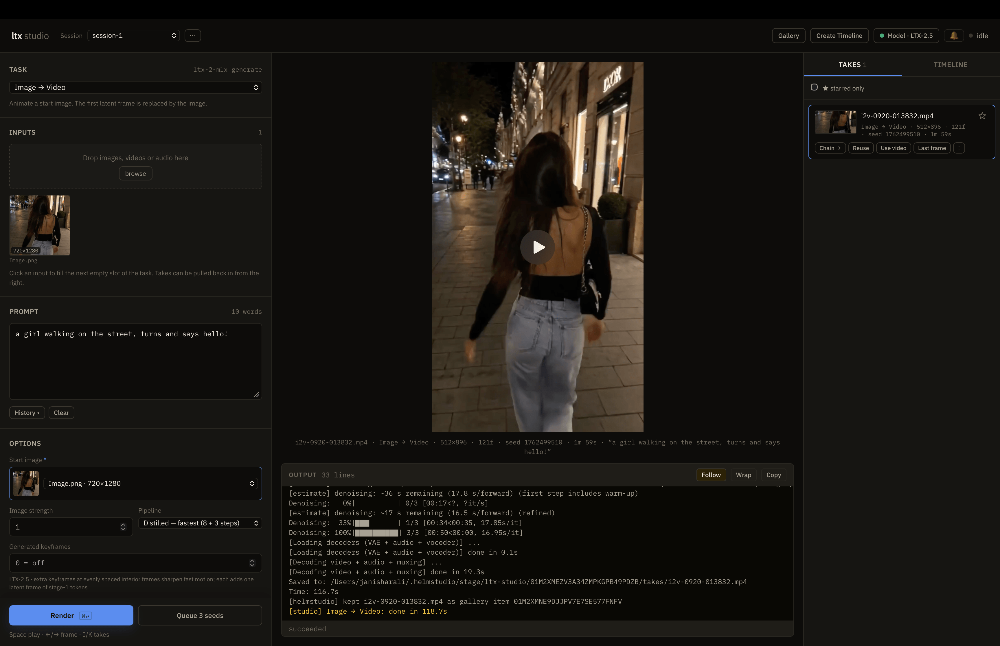

# ltx-2-studio

**LTX-2 video + audio generation on Apple Silicon, natively on MLX — with a
local web studio.**

ltx-2-studio runs [Lightricks LTX-2](https://github.com/Lightricks/LTX-2)
(LTX-2.3 and LTX-2.5) on Metal through MLX: text, image, audio and video to
video with synchronized stereo audio, retake/extend, keyframes, IC-LoRA
control, prompt beats and LoRA training. It loads the **official Lightricks
LTX-2.5 files directly** — converting and quantizing them in memory at load
time, no conversion step — and ships **ltx studio**, a browser UI over every
command with a take history, chaining, and a timeline editor. Nothing is sent
off your machine.

[](pyproject.toml)
[](https://github.com/ml-explore/mlx)
[](#requirements)
[](LICENSE)

<p align="center">
  
</p>

## Motivation

Video diffusion on Apple Silicon is underserved. The PyTorch reference runs on
the `mps` backend, where FP8 isn't available (`Float8_e4m3fn` is undefined on
MPS), so the 22B LTX-2.5 transformer has to stay in bf16 — about 44 GB of a
Mac's unified memory before a single activation. MLX quantizes the same
weights to int8 on the GPU and runs the model natively on Metal.

On a MacBook Pro M5 Pro with 64 GB, the same 49-frame 704×448 distilled
generation (same prompt, seed and settings):

| | LTX-2 (PyTorch, MPS) · bf16 | ltx-2-studio · int8 on load |
| --- | --- | --- |
| Total time | 142.0 s | **39.9 s** |
| Peak memory | 43.7 GB footprint | **20.9 GiB** MLX peak |

ltx studio exists to make that usable as a tool — a browser UI over the CLI
instead of hand-built command lines.

## Table of contents

- [Motivation](#motivation)
- [Requirements](#requirements)
- [Installation](#installation)
- [Downloading the weights](#downloading-the-weights)
- [Usage](#usage)
  - [Web studio](#web-studio)
  - [Command line](#command-line)
  - [Mode launcher](#mode-launcher)
  - [Python API](#python-api)
- [Features](#features)
- [Sessions and state](#sessions-and-state)
- [Performance notes](#performance-notes)
- [Model support](#model-support)
- [CLI reference](#cli-reference)
- [Limits](#limits)
- [Contributing](#contributing)
- [License](#license)
- [Acknowledgments](#acknowledgments)

## Requirements

### Hardware and OS

- **Apple Silicon Mac** (M1 or later). MLX runs on Metal; Intel Macs are not
  supported.
- **Unified memory:** validated on a 64 GB MacBook Pro (M5 Pro). With int8
  quantize-on-load the LTX-2.5 transformer needs ~21 GB, so short clips at
  704×448 peak around 21 GiB. Longer or larger clips grow attention memory
  quadratically — a 5 s 1280×704 clip peaked at ~76 GiB and swapped on 64 GB.
  Smaller Macs can use int4, shorter clips, or `--low-ram` with a converted
  pack.
- **Disk:** the official LTX-2.5 files for the distilled pipeline are ~71 GB;
  add ~42 GB for the dev transformer. Fast internal storage is recommended.

### Toolchain

- **Python 3.11+** and **[uv](https://docs.astral.sh/uv/)**.
- **FFmpeg and FFprobe on `PATH`** — video encoding, and in the web studio
  media probing and frame/audio extraction. `brew install ffmpeg`.
- **[helmstudio](https://github.com/janishar/helmstudio)** for the web studio,
  which keeps everything through helmstudio's runtime SDK: helmstudio itself,
  or its `helm` CLI to run the studio on its own, installed with helmstudio's
  installer (see [Web studio](#web-studio)).
- **Hugging Face CLI** (`hf`, installed with the dependencies) to download
  weights.

## Installation

```bash
git clone https://github.com/janishar/ltx-2-studio.git
cd ltx-2-studio
uv sync --all-extras
```

This installs three workspace packages (`ltx-core-mlx`, `ltx-pipelines-mlx`,
`ltx-trainer-mlx`) and the `ltx-2-mlx` command into `.venv`, with helmstudio's
runtime SDK (`helm-runtime-sdk`, from PyPI) for the web studio.

## Downloading the weights

ltx-2-studio does not ship weights. Review the model license on
[Lightricks/LTX-2.5](https://huggingface.co/Lightricks/LTX-2.5), accept its
terms on Hugging Face, and log in with a read token.

### LTX-2.5 — official files (recommended)

```bash
hf auth login
hf download Lightricks/LTX-2.5 \
    diffusion_models/ltx-2.5-22b-distilled-transformer-bf16.safetensors \
    text_encoders/gemma4-12b-with-proj-ltx-2.5-bf16.safetensors \
    vae/ltx-2.5-video-vae-conv-bf16.safetensors \
    vae/ltx-2.5-audio-vae-bf16.safetensors \
    latent_upscale_models/ltx-2.5-latent-spatial-upscaler-x2-bf16-1.0.safetensors \
    model_patches/ltx-2.5-duration-head-bf16.safetensors \
    --local-dir ./models/ltx-2.5
```

Point `--model` at that directory. Files are found by name anywhere under it,
so the layout can differ. What each file unlocks:

| File | Needed for |
| --- | --- |
| `ltx-2.5-22b-distilled-transformer-bf16` | Distilled text/image → video, multi-image anchors, prompt beats |
| `gemma4-12b-with-proj-ltx-2.5-bf16` | Every generation (text encoder + tokenizer) |
| `ltx-2.5-video-vae-conv-bf16`, `ltx-2.5-audio-vae-bf16` | Every generation (decode + audio) |
| `ltx-2.5-latent-spatial-upscaler-x2-bf16-1.0` | Two-stage upscaling |
| `ltx-2.5-duration-head-bf16` *(optional)* | Auto duration (omit `-f`) |
| `ltx-2.5-22b-dev-transformer-bf16` *(optional, ~42 GB)* | Two-stage / HQ / one-stage, audio → video, retake, extend, keyframe interpolation |
| `ltx-2.5-latent-temporal-upscaler-x2-bf16-1.0` *(optional)* | Temporal upscaling |

Nothing converted is written to disk: at load time the weights are renamed,
transposed to MLX layout and quantized per `--quantize-on-load` (`8` default,
`4`, or `none` for bf16). Only small config and tokenizer files are cached in
`.cache/virtual-packs/`.

### LTX-2.3 and converted packs

`--model` also accepts a directory (or Hugging Face repo id) of an
**MLX-converted pack** — split, channels-last safetensors with an
`embedded_config.json`. LTX-2.3 runs only from such packs, and they are
required for `--low-ram` block streaming and the IC-LoRA family (`ic-lora`,
`hdr-ic-lora`, `lipdub`). Pre-converted MLX packs made with
mlx-forge load as-is; there is no
default model, so pass `--model` or set `LTX_MODEL`.

## Usage

### Web studio

```bash
/bin/bash -c "$(curl -fsSL https://raw.githubusercontent.com/janishar/helmstudio/main/installer/install.sh)"   # helm, once
LTX_MODEL=./models/ltx-2.5 bash web/run.sh
```

Open http://127.0.0.1:8720. `web/run.sh` runs the studio under helmstudio's
`helm dev`. The first line installs `helm` into `~/.local/bin` from
helmstudio's releases, checked against the release's checksums; running it
again updates `helm`. helmstudio can also start the studio from
`helmstudio.yaml`.
**There is no authentication** — see [Limits](#limits) before binding to
anything other than `127.0.0.1`. [web/README.md](web/README.md) is the full
studio guide: running it, VS Code, and where everything is kept.

### Command line

```bash
M=./models/ltx-2.5

# Text → video (distilled: 8 + 3 steps, fastest). --frame-rate is required.
ltx-2-mlx generate --distilled --model $M --frame-rate 24 -f 49 \
    -p "A red fox trots through fresh snow in a pine forest at dawn" -o fox.mp4

# Let the LTX-2.5 DurationHead pick the length (clamped to 2–6 s)
ltx-2-mlx generate --distilled --model $M --frame-rate 24 --auto-duration 2:6 \
    -p "a heavy wooden door creaks slowly open" -o door.mp4

# Image → video, 720p, 5 seconds
ltx-2-mlx generate --distilled --model $M --frame-rate 24 -f 121 -W 1280 -H 704 \
    --image face.png -p "she turns toward the camera and smiles" -o smile.mp4

# First + last frame
ltx-2-mlx generate --distilled --model $M --frame-rate 24 -f 49 \
    --image day.png 0 1.0 --image night.png 48 1.0 -p "day fades to night" -o dusk.mp4

# Prompt beats (Prompt Relay): local prompts over time, global prompt throughout
ltx-2-mlx generate --distilled --model $M --frame-rate 24 -f 97 -p "cinematic kitchen" \
    --segment "chopping onions" --segment "plating the dish" -o kitchen.mp4

# bf16 or int4 instead of the int8 default
ltx-2-mlx generate --distilled --model $M --frame-rate 24 -f 49 --quantize-on-load none -p "..." -o bf16.mp4

# With the dev transformer: two-stage + CFG, audio → video, retake, extend, keyframes
ltx-2-mlx generate --two-stage --model $M --frame-rate 24 -f 97 -p "..." -o two_stage.mp4
ltx-2-mlx a2v      --model $M --frame-rate 24 --audio song.wav -p "a singer on stage" -o a2v.mp4
ltx-2-mlx retake   --model $M --video clip.mp4 --start 2 --end 5 -p "he waves instead" -o retake.mp4
ltx-2-mlx extend   --model $M --video clip.mp4 --extend-frames 6 -p "the car drives off" -o extend.mp4
ltx-2-mlx keyframe --model $M --frame-rate 24 --start a.png --end b.png -p "a smooth morph" -o morph.mp4
```

Frame counts must be `8k + 1` (9, 17, 25 … 97, 121 = 5 s at 24 fps). Omit
`-f` on LTX-2.5 to auto-predict the duration. See the
[CLI reference](#cli-reference) for every subcommand and flag.

### Mode launcher

`scripts/ltx_run.py` wraps the CLI with one command per input type, taking
seconds and file paths instead of frame counts and latent indices, and prints
the exact `ltx-2-mlx` command it runs:

```bash
export LTX_MODEL=./models/ltx-2.5
uv run python scripts/ltx_run.py modes      # what this model can run
uv run python scripts/ltx_run.py t2v     -p "a fox in the snow" --seconds 3 --size 720p
uv run python scripts/ltx_run.py i2v     -p "she turns and smiles" --image face.jpg
uv run python scripts/ltx_run.py flf2v   -p "day turns to night" --first day.png --last night.png
uv run python scripts/ltx_run.py anchors -p "a walk" --anchor start.png@0 --anchor mid.png@1.5@0.8
uv run python scripts/ltx_run.py story   -p "cinematic kitchen" --beat "chopping onions" --beat "serving"
uv run python scripts/ltx_run.py retake  -p "he waves instead" --video clip.mp4 --from 1 --to 2.5
uv run python scripts/ltx_run.py extend  -p "the car drives off" --video clip.mp4 --add-seconds 2
uv run python scripts/ltx_run.py demo       # every supported mode, chaining outputs as inputs
```

Common flags: `--size {small,square,portrait,sd,720p,1080p}` or `-W/-H`,
`--seconds` or `--frames`, `--auto-duration`, `--fps`, `--seed`,
`--quantize {8,4,none}`, `--pipeline {distilled,two-stage,hq,one-stage}`,
`--dry-run`; anything after `--` passes straight through. Outputs default to
`outputs/<mode>-<time>-s<seed>.mp4`.

### Python API

Every public pipeline class mirrors an upstream Lightricks LTX-2 pipeline:

```python
from ltx_pipelines_mlx import DistilledPipeline

pipe = DistilledPipeline(model_dir="./models/ltx-2.5")
pipe.generate_and_save(
    prompt="A sunset over the ocean with waves crashing",
    output_path="sunset.mp4",
    height=448,
    width=704,
    num_frames=49,
    frame_rate=24.0,
    seed=42,
)
```

Other classes: `TI2VidTwoStagesPipeline` (dev + CFG + upscale),
`TI2VidTwoStagesHQPipeline` (res_2s sampler), `TI2VidOneStagePipeline`,
`A2VidPipelineTwoStage`, `RetakePipeline` (retake and extend),
`KeyframeInterpolationPipeline`, `ICLoraPipeline`, `HDRICLoraPipeline`,
`LipDubPipeline`.

## Features

**Official weights, converted on load.** Point `--model` at the Lightricks
LTX-2.5 download. Weights are renamed, transposed and quantized to int8, int4
or left bf16 in memory; only configs and tokenizer assets are cached. The
transformer and Gemma quantize in about 5 s each on an M5 Pro.

**Every way to generate.** Text, image, first+last frame, multi-image anchors
and prompt beats → video; audio → video; retake a time range; extend before or
after; keyframe interpolation; IC-LoRA control video (depth, canny, pose,
motion tracks), HDR output and lip dub; prompt enhancement; clip slicing,
dataset preprocessing and LoRA training. Every video comes with synchronized
48 kHz stereo audio.

**A studio, not a command line.** ltx studio renders a form for each task from
a declarative catalog (`web/static/tasks.js`), checks inputs before launch,
shows the exact command, and greys out tasks the loaded model can't run (dev
transformer missing, IC-LoRA on LTX-2.5) with the reason. Canvas size is
picked by aspect ratio (or the input's) and megapixels, solved onto the ×64
(two-stage) or ×32 (one-stage) grid LTX requires. Renders queue one at
a time with live phase, denoising-step progress, elapsed time, Stop, and a
streaming terminal. **Queue 3 seeds** is the cheapest way to judge a prompt.

**Continue from any take.** Every take carries its full settings and exact
command:

- **Reuse settings** restores the task, inputs and every form value.
- **Chain →** extracts the last frame and makes it the start image of the next
  Image → Video shot.
- **Last frame / First frame** add a frame to the input library.
- **Use video** and **Use audio** bring the clip or its soundtrack back in as
  inputs for retake, extend, control or audio → video.

**Timeline.** **Create Timeline** opens helmstudio's timeline: pick takes from
the gallery, reorder, trim, dissolve, set gain and undo, then export; the
export can come back in as an input.

**Live preview (optional).** Tick **Live preview** under the Render button and
the studio streams short animated WebP previews into the viewer while the model
denoises, so a bad composition or broken motion shows up at step 2 instead of
after the full render. You choose how often (every N steps; the last step is
always shown), how long a clip (a still frame, or 17 / 57 / 121 frames) and
where in the video (start, middle, end or a frame index). Each preview is
labelled with its step and stage. Once the take finishes, **Previews (N)**
lets you scrub back through how it formed. It costs a VAE decode per preview
and keeps the decoder in memory, so it is off by default. Supported by text,
image and audio → video, retake, extend, keyframe and the IC-LoRA tasks.
From the CLI the same previews come from `--stepwise-image-output-dir`.

**Memory tools.** `--low-ram` streams transformer blocks from a converted pack
(q8 on 16 GB, bf16 on 32 GB). `--tile-frames` / `--tile-spatial` split
attention for long or HD clips.

## Sessions and state

The studio keeps nothing of its own. Sessions and their settings, inputs,
takes, render logs, preferences and sequences are kept by helmstudio through
its runtime SDK — see
[web/README.md](web/README.md#where-things-are-kept).

## Performance notes

Measured on a MacBook Pro M5 Pro, 64 GB, official LTX-2.5 files, distilled
pipeline, int8 quantize-on-load:

| Clip | Wall time | Peak MLX memory |
| --- | --- | --- |
| 704×448, 49 frames (2 s) | ~40 s | 20.9 GiB |
| 1280×704, 121 frames (5 s) | 207.5 s | 75.9 GiB (swapped) |

For 1080p or longer clips on 64 GB, tile attention (`--tile-spatial 2`) or
shorten the clip; int4 saves weight memory but attention dominates at large
sizes.

## Model support

| Feature | LTX-2.5 official files | Converted packs |
| --- | --- | --- |
| Distilled text/image → video, anchors, prompt beats | ✅ | ✅ |
| Auto duration (DurationHead) | ✅ with the duration head file | LTX-2.5 packs |
| Two-stage / HQ / one-stage, a2v, retake, extend, keyframe | with the dev transformer (not yet validated on official files) | ✅ |
| IC-LoRA, HDR IC-LoRA, lip dub | — (no official LTX-2.5 task IC-LoRAs) | LTX-2.3 packs |
| `--low-ram` block streaming | — | ✅ |
| Prompt enhancement, TeaCache | — (Gemma 3 / LTX-2.3 only) | LTX-2.3 packs |

Pipeline stability tiers are documented in
[docs/PIPELINE_MATURITY.md](docs/PIPELINE_MATURITY.md); the full
command-to-pipeline matrix is in [docs/PIPELINES.md](docs/PIPELINES.md).

## CLI reference

```
ltx-2-mlx generate   Text/image → video
  --prompt, -p           Text prompt (required)
  --output, -o           Output .mp4 (required)
  --model, -m            Model directory or Hugging Face repo
  --quantize-on-load     8 | 4 | none — official LTX-2.5 files only (default: 8)
  --distilled | --two-stage | --two-stages-hq | --one-stage   Pipeline
  --height, -H / --width, -W   Output size (multiples of 64 for two-stage)
  --frames, -f           8k+1 frame count; optional on LTX-2.5 (auto duration)
  --frame-rate           Output fps (required)
  --auto-duration MIN:MAX   Clamp the predicted duration in seconds
  --image, -i PATH [FRAME STRENGTH [CRF]]   Image anchor, repeatable
  --segment TEXT [LEN]   Prompt Relay beat, repeatable
  --seed, -s             Seed (-1 = random)
  --steps / --stage1-steps / --stage2-steps   Denoising steps
  --cfg-scale / --stg-scale   Guidance (dev pipelines)
  --lora PATH STRENGTH   LoRA, repeatable
  --no-audio             Skip audio decode and mux
  --video-decoder {conv,diffusion}   Video VAE decoder; diffusion is the LTX-2.5
                         NADiffusionDecoder (sharper, slower, single tile)
  --low-ram              Block streaming (converted packs)
  --tile-frames / --tile-spatial / --tile-overlap   Modality tiling
  --enhance-prompt       Rewrite the prompt with Gemma 3 first

ltx-2-mlx a2v        Audio → video (dev model + CFG)
  --audio, -a  --audio-start  --image  --frame-rate  --stage1-steps  --stage2-steps  --cfg-scale  --stg-scale

ltx-2-mlx retake     Regenerate latent frames [--start, --end) of --video (dev model)
  --video, -v  --start  --end  --steps  --cfg-scale  --stg-scale  --no-regen-audio

ltx-2-mlx extend     Add --extend-frames latent frames --direction before|after (dev model)

ltx-2-mlx keyframe   Interpolate --start and --end images (dev model + CFG)

ltx-2-mlx ic-lora    Control video → video with an IC-LoRA
  --lora PATH STRENGTH  --video-conditioning PATH STRENGTH  --image
  --skip-stage-2 | --upsample-only [--refine-steps N] | --single-stage

ltx-2-mlx hdr-ic-lora   Linear HDR output (.mp4 preview + .hdr.npz)
ltx-2-mlx lipdub        Lip-dub a --reference-video with the LipDub IC-LoRA
ltx-2-mlx enhance       Prompt enhancement only (--mode t2v|i2v)
ltx-2-mlx info          Model files and memory estimate
ltx-2-mlx slice         Cut source videos into training clips
ltx-2-mlx preprocess    Encode clips + captions into training latents
ltx-2-mlx train         Train a LoRA from a YAML config
```

Every generating subcommand also accepts `--stepwise-image-output-dir DIR`,
`--stepwise-interval N`, `--stepwise-frames N` and `--stepwise-frame I` for
animated in-progress previews. Run `ltx-2-mlx <command> --help` for defaults.

### Environment variables

- `LTX_MODEL` / `LTX_GEMMA` — default `--model` / `--gemma` for the CLI and the mode launcher; `web/run.sh` links the studio's weights from `LTX_MODEL`. There is no built-in default model.
- `LTX_MLX_QUANTIZE_ON_LOAD` — `8` | `4` | `none` for official weights (set by `--quantize-on-load`).
- `LTX_MLX_CACHE_DIR` — where virtual packs for official weights are cached (default `<repo>/.cache/virtual-packs`).
- `LTX2_GEMMA_EVAL_EVERY=N` / `LTX2_DIT_EVAL_EVERY=N` — `mx.eval` cadence that keeps Metal command buffers under the macOS GPU watchdog (defaults `1` / `8`; `0` disables).
- `LTX2_GEMMA_MAX_LENGTH=N` — cap the padded Gemma length (default `1024`); lower values risk quality.

## Limits

- One render at a time, deliberately — one GPU.
- Stop sends `SIGTERM`, then `SIGKILL` after a short timeout; a stopped render
  leaves no take.
- Official LTX-2.5 files re-quantize on every run (seconds), and `--low-ram`
  needs a converted pack.
- The IC-LoRA family, prompt enhancement and TeaCache need LTX-2.3 packs.
- The studio binds to `127.0.0.1` by default and has **no authentication** —
  anyone who can reach the port can run jobs and read what helmstudio keeps
  for it. Don't expose it on an untrusted network.

## Contributing

Contributions are welcome — bug reports, feature requests and pull requests on
[github.com/janishar/ltx-2-studio](https://github.com/janishar/ltx-2-studio).

- Run the fast suite with `uv run pytest -m "not slow"` and lint with
  `uv run ruff check . && uv run ruff format --check .`.
- Weight-gated tests skip unless `LTX_TEST_MODEL_DIR` (LTX-2.3 int8 pack) or
  `LTX_TEST_LTX25_PACK_DIR` (LTX-2.5 int8 pack) point at local packs;
  `LTX25_OFFICIAL_DIR` enables the official-weights loader tests.
- The web studio keeps everything through helmstudio's runtime SDK, its one
  dependency: stdlib Python server, vanilla JS, no build step. New tasks go in
  `web/static/tasks.js`.
- Use conventional commit messages (`feat:`, `fix:`, `docs:`, `chore:`).
- Releases are manual: `scripts/bump_version.py X.Y.Z`, add the
  `CHANGELOG.md` entry, then tag `vX.Y.Z`.

## License

The source code in this repository is licensed under the [MIT License](LICENSE).

LTX-2 model weights are **not** part of this repository and are distributed
separately by Lightricks under their own license — review
[the model card on Hugging Face](https://huggingface.co/Lightricks/LTX-2.5)
before downloading or using them.

## Acknowledgments

- [Lightricks](https://github.com/Lightricks/LTX-2) for the LTX-2 models and the
  reference implementation the pipelines mirror.
- [Apple MLX](https://github.com/ml-explore/mlx) for the framework that makes
  native Apple Silicon inference possible.
